# Manufacturing Execution System Project

This project represents my attempt to create a simple `Manufacturing Execution System (MES)` for the management of just-in-time flows for for suppliers of automotive industries that continue to maintain a system based on the use of paper and Excel files and that may not have the funds to put in an expensive MES.

## Live Demo

You can try a demo of the system using the following link:
https://ysyassine.github.io/mes_project/

**_Please note_**

- To access the demo just press the `"Demo"` button.
- This application is not responsive as it is meant to be used on large screens and tablets.

## Authentication Interface

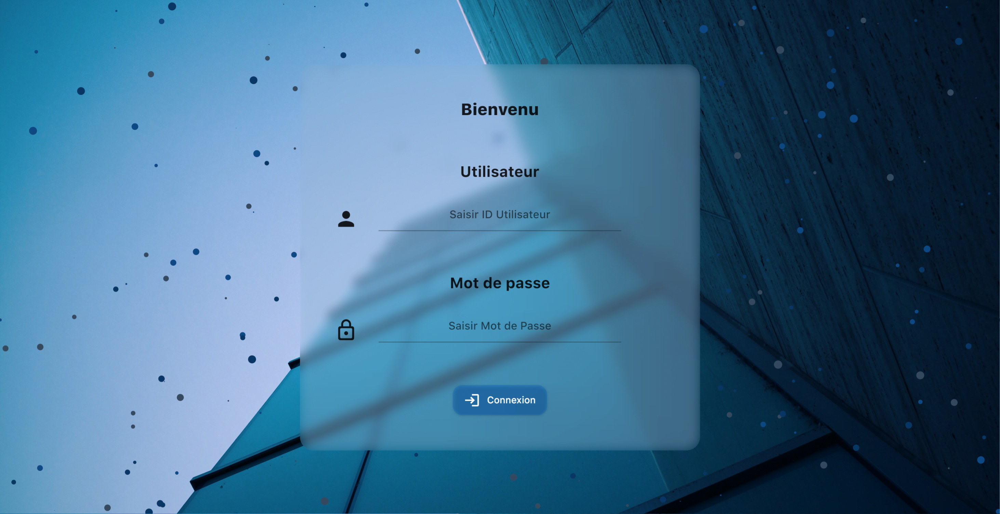

From this screen, the user logs in to the system using an account defined by an identifier and password.\
Access rights to operations vary depending on the type of the user's account. For example, only superiors are able to authenticate remotely. As for workshop operators, they can only log in from the company's internet network.

## Main Menu

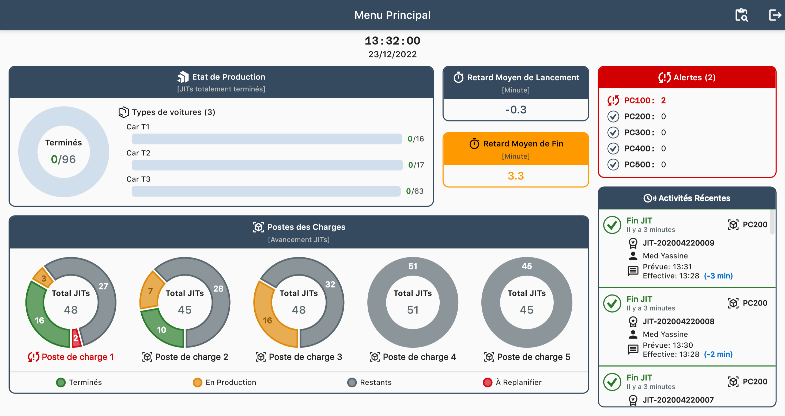

At this menu, we find several key performance indicators (KPIs) related to the overall production of the factory.

In fact, supervisors can consult the number of fully completed JITs grouped by car type. They can also track the number of JIT calls according to their progress (Completed, in production, waiting, and to be rescheduled) grouped by load position.\
We also find KPIs presenting the average launch and end delays throughout the factory.
With this screen, we check the number of alerts in the load positions. For our system, an alert is represented by a JIT call waiting to be rescheduled.\
Finally, we find the most recent activities carried out in the factory with their details.

## Charging Station Tracking Interface

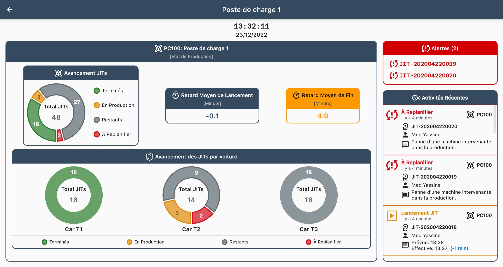

This menu corresponds to a macroscopic representation of the production for a given charge position.

At this interface level, we find KPIs related to the production of a charge position. Supervisors can consult the progress of JIT calls in the selected position. They can also track the production status (Completed, in production, waiting, and to be rescheduled) of these production orders according to their progress grouped by car type.\
We also find KPIs presenting the average launch and end delays in the position. This interface allows supervisors to check the number of alerts as well as the JIT calls affected by these alerts.\
Finally, we find the most recent activities carried out in the position with their details.

## Average Delay Tracking Interface

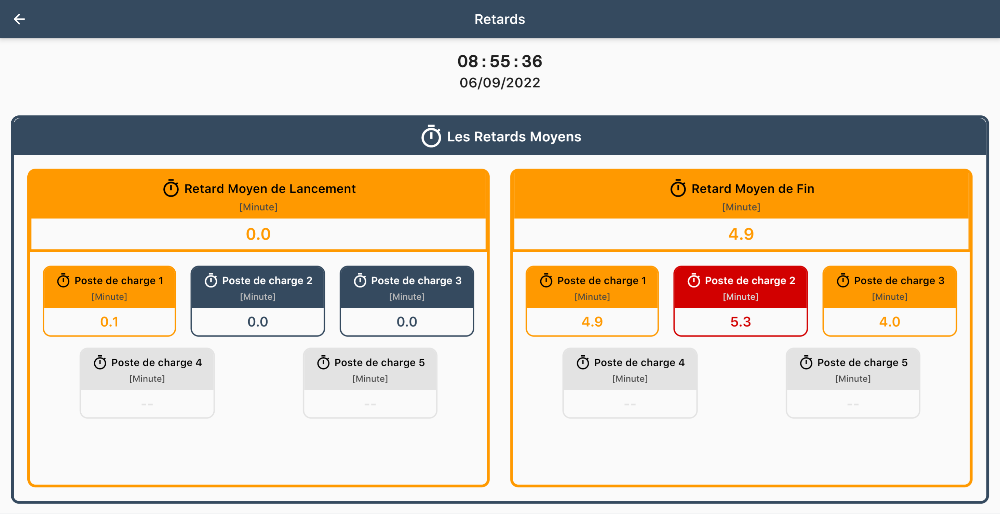

In order to facilitate the identification of items requiring intervention by production managers, we propose the average delay monitoring interface.

This interface gathers the KPIs related to the launch and end times of JIT calls grouped by workload item. This allows supervisors to easily identify items requiring immediate action to properly conduct just-in-time production.

## Production Monitoring Menu

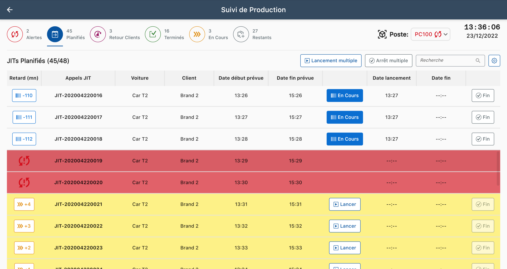

Through this menu, operators follow the production schedule represented by tables containing the JIT calls to be produced.

Operators can switch between the different tables containing scheduled calls, customer returns, internal rescheduling and alerts.\
A JIT call is represented by a line in the table that indicates the current or effective delay, the JIT identifier which is the chassis number of the car concerned, the type of car, the customer and the planned and effective launch and end dates. The operators can then declare the launch and the end of a JIT call thanks to the buttons on each line of the table.\
In addition, operators can switch from one station to another, for example, to check the cause of a delay in the transfer of a semi-finished product from another station.

Add to that, operators can use the multiple start and stop menus accessible through the multiple start and stop buttons.

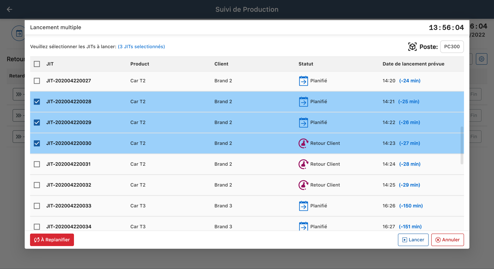

Operators can also request the rescheduling of JIT calls in case of problems. This request is made through a specific window accessible when pressing the "To be rescheduled" button. The operator must provide the reason for this request and confirm his choice.

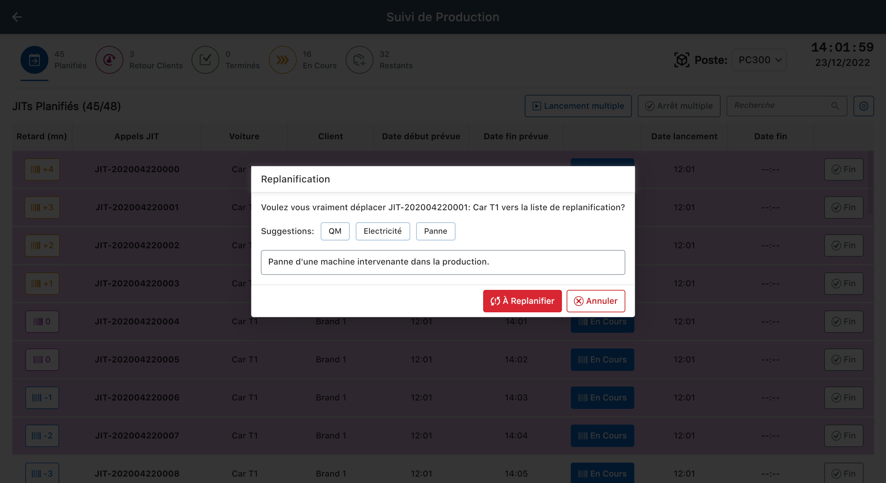

Production managers also use the production tracking menu to reschedule JITs with alert status. In fact, by consulting the "Alerts" section the application lists all the rescheduling requests accompanied by the operator operator, the reason and the date of the request as well as additional information about the the JIT call before the rescheduling request.

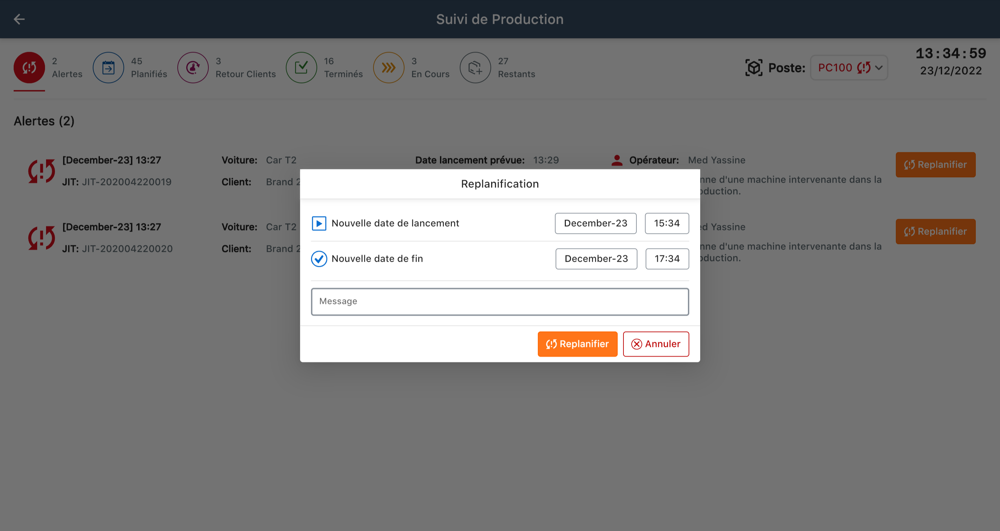

On this window, the supervisor chooses the new start and end dates, leaves a comment if necessary and confirms his action.\
It should be noted that the application is able to automatically provide the expected end date based on the duration of the production cycle on the workstation concerned.

## JIT Call Details Interface

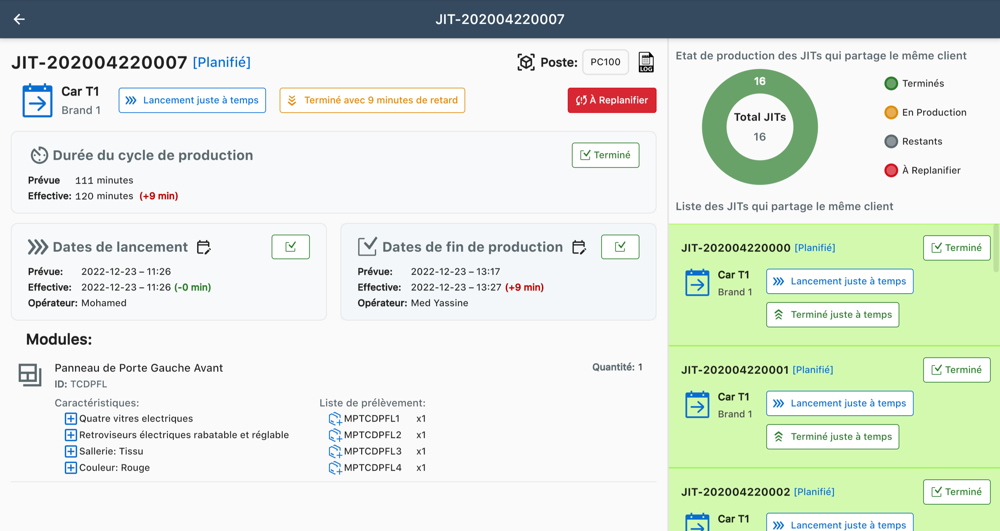

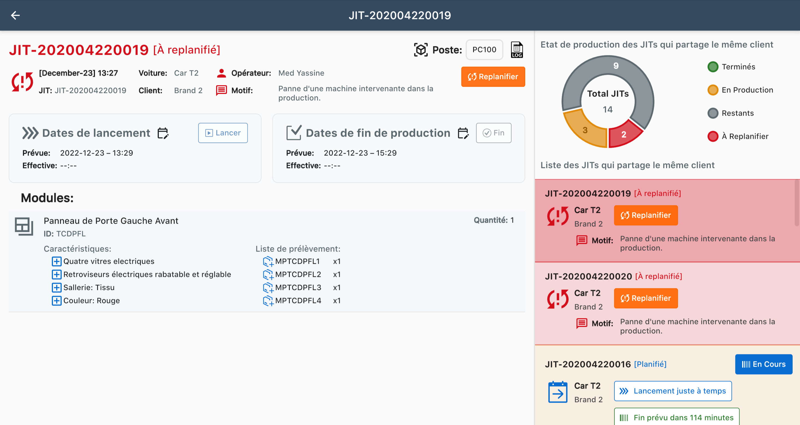

In this screen, all the details related to a JIT call are shown, which are are as follows:

- The JIT identifier.
- The production status of the JIT call: Completed, in progress, waiting to be launched.
- The status of the JIT call: Scheduled, internally rescheduled, customer return and alert.
- The type of car involved and the customer.
- The position concerned.
- A button to consult the history (log) of the JIT call.
- A button to request rescheduling.
- The expected and actual production cycle time with an indicator of the difference in minutes between the two.
- The start and end statements with the corresponding dates and operators.
- The modules with their quantities, characteristics and the corresponding pick list. it will be noted in red).
- The list of JIT calls that share the same customer with the selected one and a KPI indicating their production status.

## Logs Management

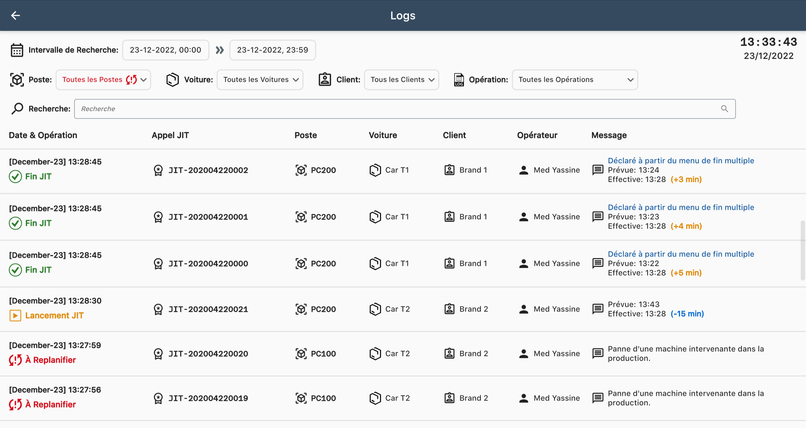

The history management menu, also called "Logs", allows supervisors to benefit from a well-structured history presenting all the information related to the various operations performed by the operators.\
This is the menu that ensures traceability. Supervisors can rely on the various detailed and flexible filters to find any information on the operations performed.

## Supervision Interface

the supervision menu can only be consulted by higher-level operators, such as production managers.

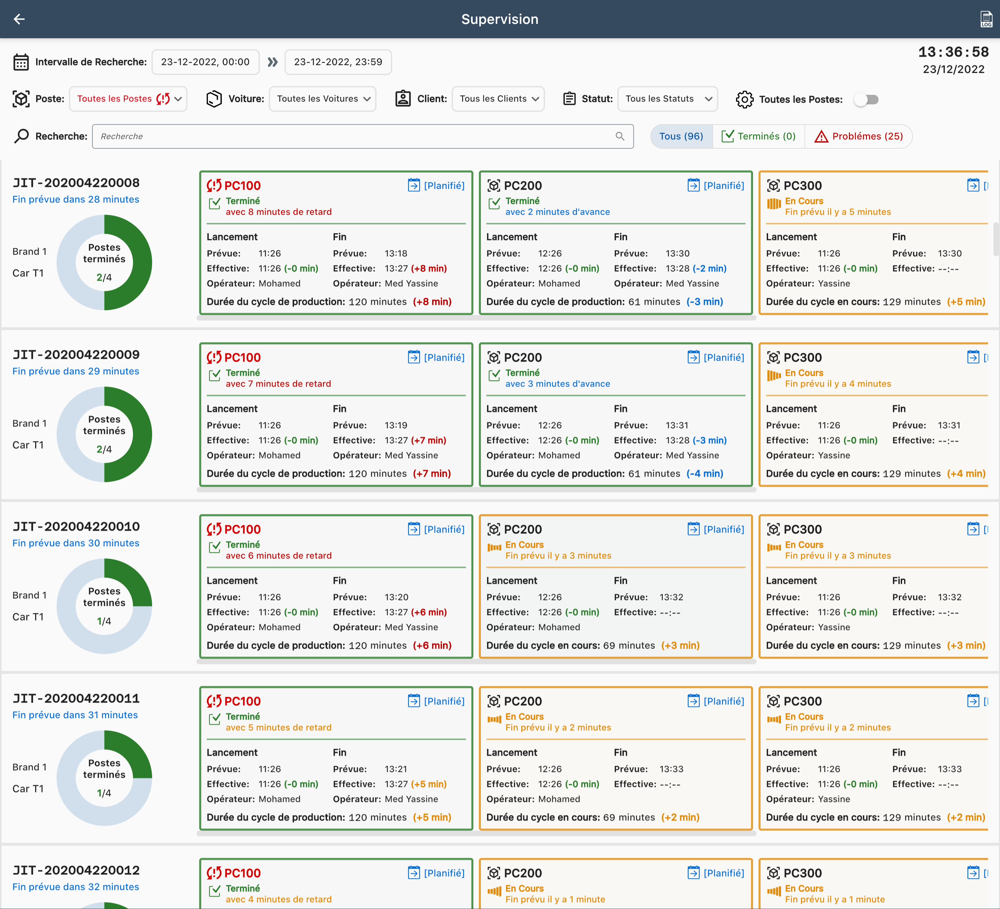

This information-rich interface allows supervisors to monitor the progress of all JITs in parallel on the various stations involved in production.\
They can also view production cycle times, start and end statements, operators involved and JIT call statuses. Supervisors can rely on a variety of detailed and customizable filters to find the JITs to check.\
In addition, the "Problems" quick filter button lists all JITs with a problematic production order such as a late start or finish, a longer than expected production cycle time, or a JIT call in need of rescheduling.
